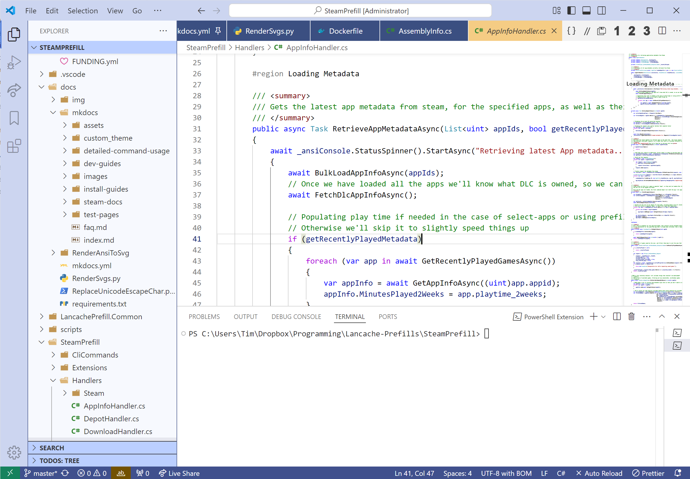

# vscode-light-blue-theme

[](https://marketplace.visualstudio.com/items?itemName=tpill90.light-blue-theme)
[](https://marketplace.visualstudio.com/items?itemName=tpill90.light-blue-theme)

<!-- TODO put a preview picture + reference the original theme that I copy pasted a lot of this stuff from -->
<!-- TODO cleanup base themes and merge them -->

A light theme for VSCode inspired by Visual Studio 2022.  Heavily draws inspiration from [ernstc/vs2022-themese-for-vscode](https://github.com/ernstc/vs2022-themes-for-vscode).




## Making changes

* Press `F5` to open a new window with your extension loaded.
* Changes to the theme file are automatically applied to the Extension Development Host window.
* Open a file that has a language associated. The languages' configured grammar will tokenize the text and assign 'scopes' to the tokens. To examine these scopes, invoke the `Developer: Inspect Editor Tokens and Scopes` command from the Command Palette (`Ctrl+Shift+P` or `Cmd+Shift+P` on Mac).

## Publishing

To publish a newer version:
```
vsce publish minor
```

## Other Links + References

* [Theme Color Reference](https://code.visualstudio.com/api/references/theme-color)
* [Guide on Creating a Color Theme](https://code.visualstudio.com/api/extension-guides/color-theme)
* [How to publish an extension](https://code.visualstudio.com/api/working-with-extensions/publishing-extension)
* [Extension Manifest Specification](https://code.visualstudio.com/api/references/extension-manifest)


